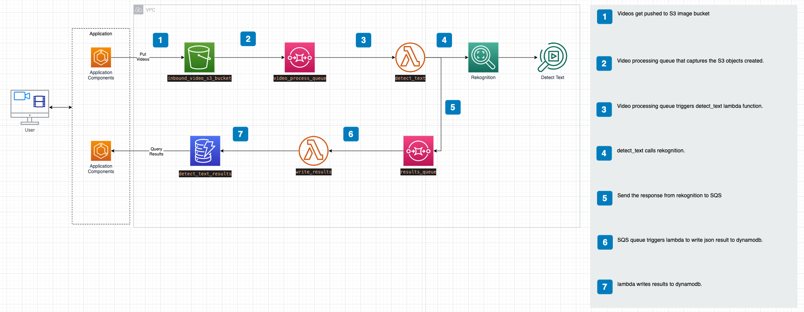

# Amazon Rekognition:  text detection using AWS CDK for Python 


## Purpose:

Show how to use AWS CDK for Python with Amazon Rekognition to recognise text in video images.

- Detect text in a set of videos on a given S3 bucket.

- Create SNS notification tight to SQS queue to determine when a text detection job of a given video has been competed

- Record texts extracted from the video in a dynamoDB table

  

## Architecture:



## Running the code

There is one demonstration in this code:

* Detecting text from a video

This CDK code create two stacks:

- rov-rekogntion-prod: production stack
- Rov-rekogntion-dev: development stack


### Deploying the CDK stack to AWS

Before deploying the stacks it is necessary to create and activate the python virtual environment through the following commands:

To manually create a virtualenv on MacOS and Linux:

```
$ python3 -m venv .venv
```

After the init process completes and the virtualenv is created, you can use the following
step to activate your virtualenv.

```
$ source .venv/bin/activate
```

Once the virtualenv is activated, you can install the required dependencies.

```
$ pip install -r requirements.txt
```

At this point you can now synthesize the CloudFormation template for this code.

```
$ cdk synth
```

Deploy your stack by using:

```
$ cdk deploy --app 'cdk.out/' rov-rekogntion-dev
```

After the experimentation is done, you can destroy the stack by running:

```
$ cdk destroy --app 'cdk.out/' rov-rekogntion-dev
```


### Check detected text on DynamoDB

All text detected via Rekognition API is loaded to DynamoDB table. AWS CLI is used to query dynamoDB table.

File expression-attributes.json:

```
{
    ":v1": {"S": "CAM-HD_2020-11-29_023614_1.mp4"},
    ":v2": {"S": "CAM-"}
}

```

Query examples:

```bash
# query items in table and returns the occurence of word Gemini02 on id "CAM-HD_2020-11-29_023614_1.mp4".
aws dynamodb query \
    --table-name detect_text_results \
    --projection-expression "Gemini02" \
    --key-condition-expression "id = :v1" \
    --expression-attribute-values file://expression-attributes.json\
    --no-scan-index-forward \
    --return-consumed-capacity TOTAL
#OR
aws dynamodb query \
    --table-name detect_text_results \
    --projection-expression "Gemini02" \
    --key-condition-expression "id = :v1" \
    --expression-attribute-values '{":v1": {"S": "CAM-HD_2020-11-29_023614_1.mp4"}}'\
    --no-scan-index-forward \
    --return-consumed-capacity TOTAL

    
# retrieves a count of items matching the query, but does not retrieve any of the items themselves.
aws dynamodb query \
    --table-name detect_text_results \
    --select COUNT \
    --key-condition-expression "id = :v1" \
    --expression-attribute-values file://expression-attributes.json

```

The above queries are derived from [here](https://docs.aws.amazon.com/cli/latest/reference/dynamodb/query.html).


## Additional information

- [AWS CDK Python Reference](https://docs.aws.amazon.com/cdk/api/v2/python/aws_cdk.html)
- [Boto3 AWS SDK for Rekognition](https://boto3.amazonaws.com/v1/documentation/api/latest/reference/services/rekognition.html#Rekognition.Client.start_text_detection)
- [Amazon Rekognition documentation](https://docs.aws.amazon.com/rekognition)

